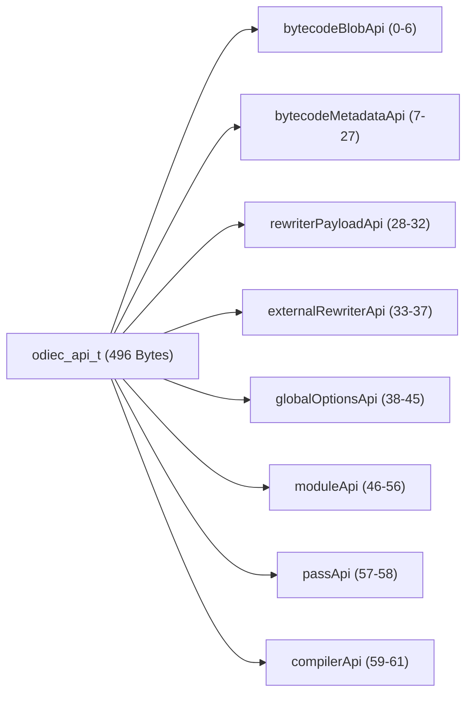
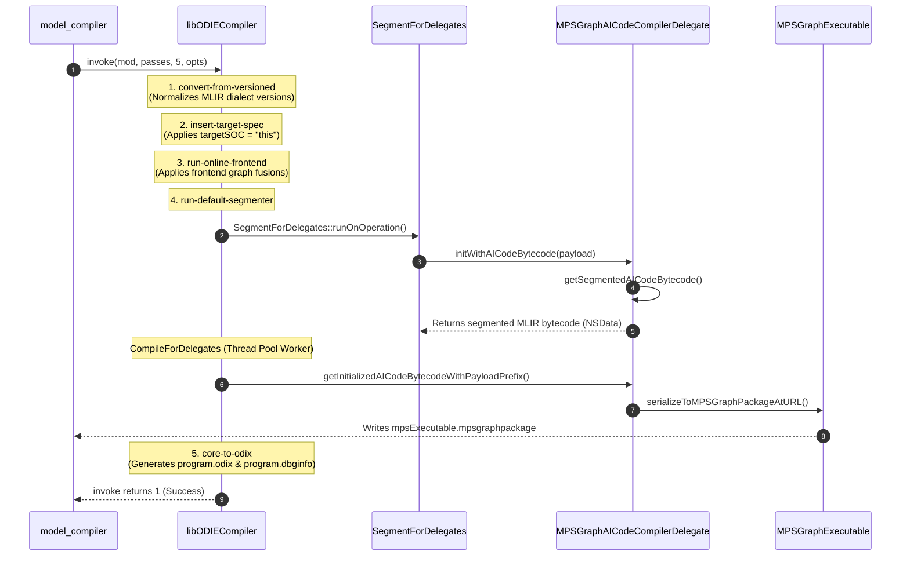

# Reverse-Engineered Technical Reference: `libODIECompiler.dylib` C-API & MLIR Pass Pipeline

This document provides a comprehensive, low-level technical reference on the native C-API of **`libODIECompiler.dylib`**, Apple's private MLIR-based optimization and lowering compiler used across **`CoreAICompiler`**, **`CoreAIDelegates`**, and **`MetalPerformanceShadersGraph`**.

---

## 1. Overview & Framework Placement

`libODIECompiler.dylib` is the core MLIR dialect compiler underpinning Apple's on-device AI compiler stack:
* **Binary Locations**:
  - `/System/Library/PrivateFrameworks/ODIE.framework/Versions/A/Frameworks/libODIECompiler.dylib`
  - `/System/Library/SubFrameworks/CoreAICompiler.framework/Versions/A/Frameworks/libODIECompiler.dylib`
* **Role**:
  - Ingests CoreAI versioned MLIR bytecode (`main.mlirb`).
  - Performs dialect normalization, target specification insertion, and frontend optimizations.
  - Partitions graph operations into backend delegate regions (e.g. `mpsGraph`, `bnns`).
  - Converts operations into `odix` dispatch indices (`program.odix`) and debug info (`program.dbginfo`).

Unlike standard LLVM/MLIR C-APIs (`mlir-c`), Apple exposes a unified C dispatch table through a single exported entrypoint: **`odiec_initialize`**.

---

## 2. The `odiec_initialize` Calling Convention & ABI Intricacies

```c
odiec_api_t odiec_initialize(void);
```

### The AAPCS64 `x8` Struct Return Mechanism
The `odiec_api_t` table contains **62 function pointers** ($62 \times 8 = 496$ bytes). Under the ARM64 Procedure Call Standard (AAPCS64):
- Structures exceeding 16 bytes cannot be returned in registers `x0`-`x1`.
- The caller must allocate a 496-byte memory buffer on the stack and pass the address of this buffer in **register `x8`** (indirect result location).
- `odiec_initialize` populates the buffer at `[x8]` and returns.

In C, declaring the signature as:
```c
typedef struct {
    void *ptrs[62];
} odiec_api_t;

typedef odiec_api_t (*odiec_initialize_fn)(void);
```
causes `clang` to automatically generate the correct `x8` setup instructions before calling the function pointer.

---

## 3. Complete Function Table Index Mapping (`odiec_api_t`)

The 62 function pointers are grouped into 8 sub-APIs:



### 1. `bytecodeBlobApi` (Indices 00–06)
| Index | Function Name | C Signature | Description |
| :--- | :--- | :--- | :--- |
| **00** | `create_bytecode_blob` | `odiec_bytecode_blob_t (*)(void)` | Allocates an in-memory bytecode container handle. |
| **01** | `destroy_bytecode_blob`| `void (*)(odiec_bytecode_blob_t)` | Frees the container handle. |
| **02** | `set_buffer` | `void (*)(odiec_bytecode_blob_t, const void *, long long)` | Wraps raw MLIR bytecode data into the blob. |
| **03** | `get_buffer` | `void (*)(odiec_bytecode_blob_t, const void **, long long *)`| Retrieves raw pointer and byte count from blob. |
| **04** | `set_buffer_deleter` | `void (*)(odiec_bytecode_blob_t, void *, void (*)(void *))` | Custom memory deleter callback. |
| **05** | `read_metadata` | `void (*)(odiec_context_t, odiec_bytecode_blob_t, odiec_bytecode_metadata_t)` | Reads graph count and tensor shapes. |
| **06** | `read_detailed_metadata` | `void (*)(odiec_context_t, odiec_bytecode_blob_t, odiec_bytecode_metadata_t)` | Reads detailed op attributes. |

### 2. `bytecodeMetadataApi` (Indices 07–27)
Provides introspection into MLIR bytecode graphs, input/output tensor types, states, storage formats, and operation types.
* `get_version`, `get_latest_version`, `get_graph_count`
* `get_input_count`, `get_input_name`, `get_input_type`
* `get_output_count`, `get_output_name`, `get_output_type`
* `get_operation_count`, `get_operation`

### 3. `rewriterPayloadApi` (Indices 28–32)
Passed to delegate rewriters when a sub-graph is extracted for external backend compilation:
| Index | Function Name | C Signature | Description |
| :--- | :--- | :--- | :--- |
| **28** | `get_bytecode_blob` | `odiec_bytecode_blob_t (*)(odiec_external_rewriter_payload_t)` | Returns the sub-graph bytecode blob. |
| **29** | `get_resource` | `void (*)(odiec_external_rewriter_payload_t, const char *, long long, const void **, long long *)` | Accesses weight buffers and constants. |
| **30** | `get_input_directory` | `void (*)(odiec_external_rewriter_payload_t, const char **, long long *)` | Input filesystem path. |
| **31** | `get_binary_directory`| `void (*)(odiec_external_rewriter_payload_t, const char **, long long *)` | Output artifact destination. |
| **32** | `report_error` | `void (*)(odiec_external_rewriter_payload_t, const char *, long long)` | Reports compilation failure to MLIR diagnostic engine. |

### 4. `externalRewriterApi` (Indices 33–37)
Registers external delegate compilers (e.g. `mpsGraph`, `bnns`):
| Index | Function Name | C Signature | Description |
| :--- | :--- | :--- | :--- |
| **33** | `create_external_rewriter` | `odiec_external_rewriter_t (*)(void)` | Instantiates a rewriter configuration object. |
| **34** | `destroy_external_rewriter`| `void (*)(odiec_external_rewriter_t)` | Frees the rewriter object. |
| **35** | `set_ir_properties` | `void (*)(odiec_external_rewriter_t, uint64_t, uint64_t, int64_t, bool)` | Sets bytecode version and dialect compatibility. |
| **36** | `set_op_version` | `void (*)(odiec_external_rewriter_t, const char *, uint64_t, uint64_t)` | Overrides specific operation versions. |
| **37** | `set_callback` | `void (*)(odiec_external_rewriter_t, void *, odiec_bytecode_blob_t (*)(void *, odiec_external_rewriter_payload_t))` | **Primary callback invoked when segmenter isolates a delegate region.** |

### 5. `globalOptionsApi` (Indices 38–45)
Configures compiler options passed to `invoke`:
* `create_global_options()`, `destroy_global_options()`
* `set_output_directory(opts, path, len)`
* `set_input_directory(opts, path, len)`
* `add_external_rewriter(opts, name, len, rewriter)`
* `set_debug_printer(opts, ctx, callback)`

### 6. `moduleApi` (Indices 46–56)
Controls the `mlir::ModuleOp` lifetime:
* **46: `create_module_from_bytecode`**: `(ctx, &blob, verify) -> mod`
* **47: `create_module_from_asm`**: `(ctx, text, len) -> mod`
* **48: `clone_module`**: `(mod) -> mod`
* **49: `destroy_module`**: `(mod) -> void`
* **51: `print_module`**: Prints MLIR textual IR to `stderr`.
* **52: `serialize_module`**: Writes compiled MLIR module to disk.
* **53: `serialize_to_bytecode_blob`**: Emits final serialized bytecode container.

### 7. `passApi` & `compilerApi` (Indices 57–61)
* **57: `create_pass_descriptor`**: Creates a pass instance by name.
* **58: `destroy_pass_descriptor`**: Frees pass descriptor memory (`pass*`).
* **59: `create_context`**: Creates the compilation context.
* **60: `destroy_context`**: Tears down compilation context.
* **61: `invoke`**: Runs an array of passes over a module:
  ```c
  int invoke(odiec_module_t mod, odiec_pass_t *passes, long long passCount, odiec_global_options_t opts);
  ```

---

## 4. Host JIT Pass Pipeline Execution Sequence

When compiling a model targeting host ANE (`targetSOC: "this"`), the pipeline executes the following 5 passes sequentially:



### Pass Details:
1. **`convert-from-versioned`**: Upgrades or normalizes legacy CoreAI op dialects into current MLIR representations.
2. **`insert-target-spec`**: Binds the target architecture attributes (`targetSOC: "this"`, `streaming="preferredDevice=NeuralEngine"`).
3. **`run-online-frontend`**: Fuses pointwise operators and prepares shapes for hardware partitioners.
4. **`run-default-segmenter`**:
   - Identifies candidate subgraphs supported by backend delegates (`mpsGraph`, `bnns`).
   - Invokes the rewriter callback (`set_callback`).
   - `MPSGraphAICodeCompilerDelegate` parses the subgraphs and compiles them into Metal Performance Shaders Graph primitives.
   - Triggers `-[MPSGraphExecutable serializeToMPSGraphPackageAtURL:descriptor:outNDXCapable:]` to output the final `.mpsgraphpackage`.
5. **`core-to-odix`**: Lowers remaining orchestration ops into runtime dispatch entries in `program.odix`.

---

## 5. Pure C Pipeline Implementation (`odiec_pipeline.c`)

[`odiec_pipeline.c`](file:///Users/freedom/work/ios-hacking/disassm_b7/odiec_pipeline.c) encapsulates this entire pipeline in pure C:

```c
#include "odiec_pipeline.h"

int odiec_pipeline_execute(const void *mlirbBytes, size_t mlirbSize, const char *outputDirectory) {
    odiec_api_t api;
    if (!odiec_pipeline_init(&api)) return -1;

    odiec_context_t ctx = api.create_context();
    odiec_bytecode_blob_t blob = api.create_bytecode_blob();
    api.set_buffer(blob, mlirbBytes, (long long)mlirbSize);

    odiec_module_t mod = api.create_module_from_bytecode(ctx, &blob, false);
    odiec_global_options_t opts = api.create_global_options();
    api.set_output_directory(opts, outputDirectory, strlen(outputDirectory));

    const char *passNames[] = {
        "convert-from-versioned",
        "insert-target-spec",
        "run-online-frontend",
        "run-default-segmenter",
        "core-to-odix"
    };

    odiec_pass_t passes[5];
    for (int i = 0; i < 5; i++) {
        passes[i] = api.create_pass_descriptor(passNames[i], strlen(passNames[i]), "", 0, "", 0);
    }

    int ret = api.invoke(mod, passes, 5, opts);

    api.destroy_global_options(opts);
    api.destroy_module(mod);
    api.destroy_context(ctx);

    return (ret == 1) ? 0 : -2;
}
```

---

## 6. Hybrid Architecture: Swift Bridge vs. Pure C

| Dimension | Hybrid Bridge (`model_compiler_bridge.swift`) | Pure C (`odiec_pipeline.c`) |
| :--- | :--- | :--- |
| **Language** | Swift (compiled to 10 KB `.o`) | Pure ISO C99 |
| **API Boundary** | `@_cdecl("compile_model_for_host")` | Direct `libODIECompiler.dylib` `odiec_*` calls |
| **Delegation Support** | ✅ Built-in Swift protocol witnesses for `mpsGraph` | Requires C rewriter callback wiring |
| **Runtime Overhead** | Zero (links standard system frameworks) | Zero (direct dlsym) |
| **Role in Project** | **Default Production Compiler** | **Reverse-Engineering & Exploration Engine** |

By pairing `model_compiler_objc` with `model_compiler_bridge.o`, we achieve an end-to-end Objective-C toolchain that requires zero shell outs, avoids all root cache directory crawling, and compiles models directly into ANE hardware packages in milliseconds.
