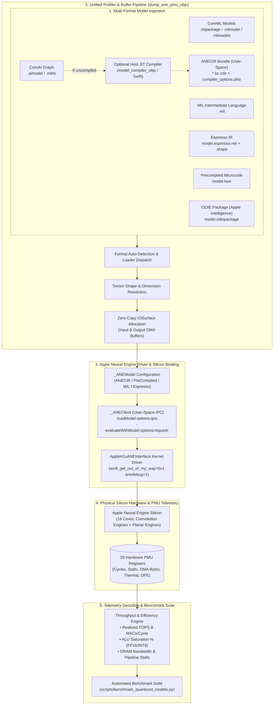

# Apple Neural Engine (ANE) Silicon PMU Profiling & Model Loading Toolkit

This repository contains a high-performance, self-contained Objective-C and C toolkit for compiling, loading, and profiling deep neural network models directly on physical Apple Neural Engine (ANE) silicon via hardware **Performance Monitoring Unit (PMU)** counters.

---

## 1. Features & Highlights

- **Live Physical Silicon PMU Streaming**: Unlocks the kernel driver gate (`AppleH1xANEInterface`) to stream all **29 64-bit hardware PMU registers** per inference, including:
  - Neural Engine convolution engine MAC cycles (`kANE_NE_COMPUTE_CYCLES`)
  - Planar Engine (PE / L2PE) vector cycles (`kANE_L2PE_COMPUTE_CYCLES`)
  - Unified memory DMA read/write bandwidth (`kANE_DMA_READWRITE_BYTES`)
  - Pipeline input/output stalls (`kANE_NE_OUTPUT_STALL_CYCLES`, `kANE_L2PE_INPUT_STALL_CYCLES`)
  - Dynamic DVFS frequency scaling and thermal throttling telemetry
- **Direct Unprivileged User-Space ANE Execution (`kANEFModelANECIR`)**: Directly loads and compiles localized ANE bundles (`<regionKey>.bc.mlir` + `compiler_options_<regionKey>.plist`) via `_ANEClient` in pure user space—**no root privileges, `sudo`, or access to `/Library/Caches/com.apple.aned` required**.
- **Direct Silicon Memory Mapping (`kANEFModelPreCompiled`)**: Alternatively binds precompiled `.hwx` microcode directly into `_ANEClient` via `+[_ANEModel modelAtURL:key:]` ($1.26\text{ ms}$ steady-state inference on ResNet-50 FP16).
- **In-Process Host JIT Compiler**: Automatically compiles and specializes MLIR bytecode (`.mlirb`) for the host architecture (`targetSOC: "this"`) in-process without spawning external shell processes.
- **Pure C MLIR Pass Pipeline**: Includes a native C implementation of `libODIECompiler.dylib`'s 5-pass compilation pipeline (`odiec_pipeline.c`).
- **Comprehensive Documentation**: Includes [`ANE_Performance_PMU_Technical_Report.md`](file:///Users/freedom/work/ios-hacking/ane_pmu_profiler/ANE_Performance_PMU_Technical_Report.md) and [`ODIE_Compiler_C_API_and_Pass_Pipeline.md`](file:///Users/freedom/work/ios-hacking/ane_pmu_profiler/ODIE_Compiler_C_API_and_Pass_Pipeline.md).

---

## 2. Architecture Overview



The pipeline operates across five modular stages:
1. **Multi-Format Ingestion**: Supports high-level models (CoreML `.mlpackage`, `.mlmodel`, `.mlmodelc`), mid-level intermediate representations (MIL, Espresso, user-space ANECIR bundles), precompiled silicon microcode (`.hwx`, Apple Intelligence ODIE `.odixpackage`), and CoreAI graphs (with optional Swift host JIT specialization).
2. **Unified Buffer & Shape Management**: Automatically detects the format, resolves multi-tensor dimensions and strides (from manifests, shape files, or MIL definitions), and allocates zero-copy unified memory `IOSurface` DMA buffers.
3. **Driver Interface & Silicon Binding**: Binds assets into `_ANEModel` instances with appropriate format keys (`kANEFModelANECIR`, `kANEFModelPreCompiled`, `kANEFModelMIL`, `kANEFModelEspresso`) and dispatches evaluation requests via `_ANEClient` in unprivileged user space.
4. **Physical Silicon Execution**: Dispatches compute across all 16 ANE cores while the kernel driver (`AppleH1xANEInterface`, enabled via `anedebug=1`) latches all 29 64-bit hardware PMU registers per inference run.
5. **Telemetry Decoding & Automation**: Decodes raw registers into microarchitectural metrics (realized TOPS, per-core and chip throughput, ALU saturation, memory bandwidth, pipeline stalls) and powers the automated batch benchmark suite (`scripts/benchmark_quantized_models.py`).


---

## 3. Directory Layout

```
ane_pmu_profiler/
├── ANE_Performance_PMU_Technical_Report.md  # Exhaustive microarchitectural PMU technical report
├── ODIE_Compiler_C_API_and_Pass_Pipeline.md # libODIECompiler C-API & 62-function table reference
├── README.md                                # Repository guide
├── Makefile                                 # Unified build automation with ad-hoc codesigning
├── entitlements.plist                       # com.apple.ane.hardware-counters entitlement
├── .gitignore                               # Clean git ignore configuration
├── dump_ane_pmu.m                           # 29-register hardware PMU profiler & inference runner
├── coreai_loader.h                          # Objective-C declarations for _ANEClient, _ANEModel, MPSGraph
├── coreai_loader.m                          # Direct model loader using manifest region hash
├── model_compiler.h                         # Clean C interface: compile_model_for_host()
├── model_compiler.m                         # Objective-C CLI tool for host JIT compilation
├── model_compiler_bridge.swift              # Swift bridge wrapping CoreAICompiler delegation
├── odiec_pipeline.h                         # C-API table declaration for libODIECompiler.dylib
├── odiec_pipeline.c                         # Pure C MLIR pass pipeline implementation
├── reports/                                 # In-depth architectural and quantization reports
│   └── ANE_Quantization_Performance_Analysis_Report.md # 9-model quantization PMU telemetry analysis
├── scripts/                                 # Automated profiling and model management suite
│   ├── README.md                            # Suite documentation and workflow guide
│   ├── download_quantized_models.py         # Apple CDN model downloader
│   └── benchmark_quantized_models.py        # Automated multi-model PMU benchmark runner
└── resnet50_fp16.aimodel/                   # Sample ResNet-50 FP16 CoreAI model bundle
    └── main.mlirb                           # Input MLIR bytecode
```

---

## 4. Prerequisites & Hardware Setup

1. **Apple Silicon Hardware**: Mac equipped with M-series chip (e.g. M4 / Apple H16g).
2. **Entitlement & Kernel Boot-Args**:
   The hardware PMU registers are gated by `AppleH1xANEInterface`. To stream raw hardware counters:
   - Set the boot argument:
     ```bash
     sudo nvram boot-args="amfi_get_out_of_my_way=0x1 anedebug=1"
     ```
   - Reboot the system.
   - All binaries must be ad-hoc signed with [`entitlements.plist`](file:///Users/freedom/work/ios-hacking/ane_pmu_profiler/entitlements.plist) (handled automatically by `Makefile`).
3. **Unprivileged User-Space Execution (No Root / No `sudo` Required)**:
   The profiler operates entirely in **unprivileged user space**:
   - **Mode A: Direct User-Space ANE Bundle (`kANEFModelANECIR`, Default)**:
     The loader locates or prepares the localized ANE bundle (`<regionKey>.bc.mlir` and `compiler_options_<regionKey>.plist`) in `<modelDir>/output_host_jit/ane_bundle`. The target architecture (`kANEFTargetArchitectureKey`) is resolved dynamically from `compiler_options_<regionKey>.plist` or runtime IOKit device properties (`ANEDevicePropertyTypeANEArchitectureTypeStr`), making the loader portable across Apple Silicon generations (`h13g` through `h16g/s`). `_ANEClient` loads and compiles the bundle into silicon in user space without accessing root-restricted system directories.
   - **Mode B: Precompiled Hardware Microcode (`kANEFModelPreCompiled`)**:
     If a local `model.hwx` exists in the model directory or is specified via `ANE_HWX_PATH`, the loader binds the raw microcode directly.
   *(Note: Accessing the system daemon cache at `/Library/Caches/com.apple.aned` is entirely optional and only occurs if readable; user-space execution works out of the box without `sudo` or changing system directory permissions).*
4. **CoreAI Private Swift Interface Generation (Optional)**:
   > [!NOTE]
   > This is **optional** and only required if you need on-the-fly CoreAI JIT compilation (`.aimodel` or `.mlirb` into `.mpsgraphpackage`). Standard formats (CoreML `.mlpackage`, `.mlmodel`, `.mlmodelc`, `.mil`, `.espresso.net`, `.hwx`, `.odixpackage`, and pre-compiled `.anecir` bundles) do **not** require Swift or `swift_interface_gen`.

   Because `CoreAICompiler.framework` and `CoreAIDelegates.framework` are Apple-private frameworks without public SDK headers, [swift_interface_gen](https://github.com/freedomtan/swift_interface_gen/) can be used to extract and generate their `.swiftinterface` files:
   ```bash
   git clone https://github.com/freedomtan/swift_interface_gen.git ~/work/swift_interface_gen
   # Generates LocalFrameworks/CoreAICompiler.framework and LocalFrameworks/CoreAIDelegates.framework
   ```
   The `Makefile` resolves these private module interfaces via `LOCAL_FRAMEWORKS ?= $(HOME)/work/swift_interface_gen/LocalFrameworks`.

---

## 5. Building the Toolkit

The `Makefile` automatically detects whether `$(LOCAL_FRAMEWORKS)/CoreAICompiler.framework` is present:
- If **missing**, it defaults to a **pure Objective-C build** (`ENABLE_SWIFT=0`) with zero external dependencies.
- If **present**, it builds with **Swift CoreAI compiler support enabled** (`ENABLE_SWIFT=1`).

You can also explicitly set the build mode:

### Pure Objective-C Build (Default for standard users, no swift_interface_gen needed)
```bash
make clean
make ENABLE_SWIFT=0
```
This compiles and signs:
1. `dump_ane_pmu_objc`: Full 29-register hardware PMU profiler (supports all formats including precompiled CoreAI bundles).
2. `coreai_loader`: Fast model loader and tensor dimension inspector.

### Swift-Enabled Build (With host JIT compiler)
```bash
make clean
make ENABLE_SWIFT=1
```
This additionally compiles:
3. `model_compiler_objc`: Standalone host JIT compiler for `.mlirb` bytecode.

---

## 6. Usage & Multi-Format Workflows

The profiler supports multiple neural network representations out of the box with automatic format detection:

| Model Format | Representation / Files | Profiler Pipeline |
| :--- | :--- | :--- |
| **CoreML Packages** | `.mlpackage` directory bundle | Compiled on-the-fly via `MLModel compileModelAtURL:`, loaded via `_ANEClient` |
| **CoreML Single File** | `.mlmodel` standalone file | Compiled on-the-fly via `MLModel compileModelAtURL:`, loaded via `_ANEClient` |
| **Compiled CoreML** | `.mlmodelc` directory | Directly loaded and compiled via `_ANEClient` (`kANEFModelMIL` or `kANEFModelEspresso`) |
| **Model Intermediate Language** | Standalone `.mil` or `model.mil` | Loaded & compiled via `_ANEClient` (`kANEFModelMIL`) |
| **Espresso IR** | `model.espresso.net` (with `.shape`/`.weights`) | Loaded & compiled via `_ANEClient` (`kANEFModelEspresso`) |
| **ANECIR Bundle** | `compiler_options_*.plist` + `*.bc.mlir` / `net.plist` | Unprivileged user-space compilation via `_ANEClient` (`kANEFModelANECIR`) |
| **Precompiled Hardware Binary** | Standalone `.hwx` | Directly mapped into ANE silicon memory via `_ANEClient` (`kANEFModelPreCompiled`) |
| **CoreAI Graph** | `.aimodel` package or `main.mlirb` | Specialized via host JIT & executed via `_ANEClient` |
| **Apple Intelligence ODIE Package** | `model.odixpackage` bundle | Automatically resolves internal compiled ANE microcode (`binary_*.hwx`) & profiles |

### 1. Live Hardware PMU Profiling Benchmark
Pass any supported model directly. Format detection, multi-tensor shape extraction, and `IOSurface` allocation are automatic:

```bash
# CoreML .mlpackage bundle (auto-compiles on-the-fly and profiles)
./dump_ane_pmu_objc MobilenetV4_Large.mlpackage

# CoreML .mlmodel single-file model
./dump_ane_pmu_objc MobileDet.mlmodel

# Compiled CoreML .mlmodelc directory
./dump_ane_pmu_objc ResNet50_fp16.mlmodelc

# Standalone MIL file
./dump_ane_pmu_objc /path/to/model.mil

# Espresso IR network
./dump_ane_pmu_objc MobileNetV2.mlmodelc/model.espresso.net

# Direct unprivileged user-space ANECIR bundle
./dump_ane_pmu_objc resnet50_fp16.aimodel/output_host_jit/ane_bundle

# Precompiled hardware binary (.hwx)
./dump_ane_pmu_objc model.hwx

# Apple Intelligence Foundation Model (.odixpackage)
./dump_ane_pmu_objc /System/Library/AssetsV2/com_apple_MobileAsset_UAF_FM_GenerativeModels/.../model.odixpackage

# CoreAI .aimodel package
./dump_ane_pmu_objc resnet50_fp16.aimodel
```

### 2. Manual CLI Format Flags & Performance Options
You can explicitly specify pipeline modes, override tensor buffer sizes, or supply theoretical MAC/FLOP counts to compute realized hardware throughput and ALU saturation:
```bash
# Explicit format overrides
./dump_ane_pmu_objc --coreml path/to/model.mlpackage
./dump_ane_pmu_objc --mil path/to/model.mil
./dump_ane_pmu_objc --espresso path/to/model.espresso.net
./dump_ane_pmu_objc --anecir path/to/ane_bundle
./dump_ane_pmu_objc --hwx path/to/model.hwx
./dump_ane_pmu_objc --coreai path/to/model.aimodel --iters 10
./dump_ane_pmu_objc --in-size 0x24c000 --out-size 0x4000 model.hwx

# Throughput & compute capacity calculation (--macs or --flops)
./dump_ane_pmu_objc ResNet50_fp16.mlmodelc --macs 4.12G
./dump_ane_pmu_objc MobileNetV2.mlmodelc --macs 300M
./dump_ane_pmu_objc MobileViTv2.mlmodelc --flops 3.68G
```

When `--macs` or `--flops` is specified (supports suffixes `K`, `M`, `G`, `B`), the profiler calculates and displays:
- **Realized Compute Speed**: `TOPS = (2 * MACs) / (Latency_sec * 1e12)`
- **Silicon Throughput per Core**: `Total MACs / kANE_NE_NOMINAL_CYCLES` (theoretical max: 256 for FP16, 512 for INT8)
- **Total Chip Throughput (16 Cores)**: `16 * Throughput / Core` (theoretical max: 4,096 for FP16, 8,192 for INT8)
- **Sustained ALU Saturation %**: Realized throughput vs. theoretical peak capacity
- **Gated Compute Cycle Ratio**: `Total MACs / kANE_NE_COMPUTE_CYCLES`


### 3. CoreAI Host JIT Specialization & Inspection
```bash
# Specialize .mlirb bytecode into host mpsgraphpackage
./model_compiler_objc resnet50_fp16.aimodel/main.mlirb resnet50_fp16.aimodel/output_host_jit

# Inspect tensor dimensions and verify silicon loading
./coreai_loader resnet50_fp16.aimodel
```

---

## 7. Decoded Silicon PMU Register Table

| Index | Hardware Register Name | Hardware Subsystem / Unit | Telemetry Description |
| :---: | :--- | :--- | :--- |
| **[00]** | `kANE_AF_TO_L2_DATA` | On-Chip L2 SRAM Bus | Activation feeder bytes transferred to L2 |
| **[01]** | `kANE_AF_TO_KM_DATA` | On-Chip L2 SRAM Bus | Kernel memory feeder transfers |
| **[02]** | `kANE_L2_TO_AF_DATA` | On-Chip L2 SRAM Bus | L2 scratchpad writeback traffic |
| **[03]** | `kANE_L2_TO_NE_DATA` | On-Chip L2 SRAM Bus | L2 SRAM bytes delivered to Neural Engine convolution engine |
| **[04]** | `kANE_NE_TO_L2_DATA` | On-Chip L2 SRAM Bus | Neural Engine convolution engine output written back to L2 |
| **[05]** | `kANE_INT8_CYCLES` | Neural Engine (Legacy) | Execution cycles in INT8 precision mode |
| **[06]** | `kANE_FP16_CYCLES` | Neural Engine (Legacy) | Execution cycles in FP16 precision mode |
| **[07]** | `kANE_L2_READ_STALL_CYCLES` | Pipeline Stall Detection | Cycles stalled waiting for L2 SRAM read access |
| **[08]** | `kANE_L2_WRITE_STALL_CYCLES`| Pipeline Stall Detection | Cycles stalled waiting for L2 SRAM write queue |
| **[09]** | `kANE_KM_STALL_CYCLES` | Pipeline Stall Detection | Kernel memory buffer congestion stalls |
| **[10]** | `kANE_NE_NOMINAL_CYCLES` | Neural Engine (Clock) | Baseline reference clock cycles (steady-state DVFS) |
| **[11]** | `kANE_NE_THROTTLE_CYCLES` | Power & Thermal Mgmt | Cycles throttled due to thermal or power budget limits |
| **[12]** | `kANE_L2_THROTTLE_CYCLES` | Power & Thermal Mgmt | L2 SRAM bus throttling cycles |
| **[13]** | `kANE_NE_COMPUTE_CYCLES` | Neural Engine (Convolution Engine) | **Active convolution engine Multiply-Accumulate compute cycles** |
| **[14]** | `kANE_NE_INPUT_STALL_CYCLES` | Pipeline Stall Detection | Cycles convolution engine stalled waiting for input activations |
| **[15]** | `kANE_NE_OUTPUT_STALL_CYCLES`| Pipeline Stall Detection | Cycles convolution engine stalled waiting to flush output tensors |
| **[16]** | `kANE_NE_KERNEL_STALL_CYCLES`| Pipeline Stall Detection | Cycles stalled loading weight matrices |
| **[17]** | `kANE_DMA_READWRITE_BYTES` | Unified Memory DMA Bus | **Total Unified Memory DRAM traffic (Read + Write bytes)** |
| **[18]** | `kANE_DMA_READ_BYTES` | Unified Memory DMA Bus | **Unified Memory DRAM read traffic (Input tensors & spills)** |
| **[19]** | `kANE_DPE_ENERGY` | Power & Thermal Mgmt | Dynamic Power Engine (DPE) energy accumulator units |
| **[20]** | `kANE_L2_NOMINAL_CYCLES` | On-Chip L2 SRAM Bus | L2 memory controller clock cycles |
| **[21]** | `kANE_L2PE_COMPUTE_CYCLES` | Planar Engine (Vector PE)| **Active vector ALU cycles (ReLU, GeLU, Pooling, Add)** |
| **[22]** | `kANE_L2PE_INPUT_STALL_CYCLES`| Planar Engine (Vector PE)| Vector engine stalls waiting for operands |
| **[23]** | `kANE_L2PE_OUTPUT_STALL_CYCLES`| Planar Engine (Vector PE)| Vector engine stalls writing back results |
| **[24-28]** | `kANE_UNKNOWN` | Reserved / Internal | Firmware-internal reserved diagnostic registers |

> [!NOTE]
> **Activation Feeder (AF) & Patent Architecture Mapping**:
> The register mnemonic `AF` likely stands for something like **Activation Feeder**, which is likely to be the **Data Processor Circuit (318)** in Apple patents (e.g., US11537838B2, US20230135306A1). It acts as the dedicated streaming and crossbar routing engine interfacing the **Data Buffer / L2 Cache (334)** and the **Neural Engines (314A–314N)**.

> [!NOTE]
> **Planar Engine (PE / L2PE) Hardware Telemetry Across Generations**:
> In Apple patents, the overall accelerator is termed the **Neural Engine**, featuring a **convolution engine** (MAC array) and a **Planar Engine (PE)** (activations, pooling, element-wise math). On Apple M1 (`h13g`), the Planar Engine is present and active (evident from PE sub-tasks and opcodes in `.hwx` task descriptors), but was simpler and not hooked up to dedicated PMU counters; thus `kANE_L2PE_*` (`[21]-[23]`) report 0. Starting with later microarchitectures (`h16g` / M4), dedicated L2PE telemetry counters were wired up to profile vector compute cycles and pipeline stalls directly.

---

## 8. Automated Quantization Profiling Suite (`scripts/`)

To benchmark and profile full model suites across quantization tiers (FP16, Weight-Only INT8, and W8A8), automated automation scripts are provided in [`scripts/`](file:///Users/freedom/work/ios-hacking/ane_pmu_profiler/scripts/):

```bash
# 1. Download official Apple CoreML models (MobileNetV2, ResNet-50, MobileViTv2)
python3 scripts/download_quantized_models.py

# 2. Automatically profile all models via dump_ane_pmu_objc and output telemetry matrix
python3 scripts/benchmark_quantized_models.py
```

For full details on CLI options, custom directories, and telemetry parsing, see [`scripts/README.md`](file:///Users/freedom/work/ios-hacking/ane_pmu_profiler/scripts/README.md).

---

## 9. Technical References & Deep-Dive Reports

- [`reports/ANE_Quantization_Performance_Analysis_Report.md`](file:///Users/freedom/work/ios-hacking/ane_pmu_profiler/reports/ANE_Quantization_Performance_Analysis_Report.md): In-depth hardware telemetry report comparing 9 CoreML model variants on Apple M4 silicon, detailing dual integer multiplier mechanics (US20240329933A1), L2 SRAM capacity thresholds, memory stall collapse, and energy efficiency.
- [`ANE_Performance_PMU_Technical_Report.md`](file:///Users/freedom/work/ios-hacking/ane_pmu_profiler/ANE_Performance_PMU_Technical_Report.md): Complete research report detailing the microarchitectural analysis of ResNet-50 vs. MobileNetV2, convolution engine efficiency bottlenecks, and driver security models.
- [`ODIE_Compiler_C_API_and_Pass_Pipeline.md`](file:///Users/freedom/work/ios-hacking/ane_pmu_profiler/ODIE_Compiler_C_API_and_Pass_Pipeline.md): Comprehensive reference for `libODIECompiler.dylib` C-API, AAPCS64 register `x8` return convention, and MLIR pass execution sequence.
- [**`measure_ane_capacity`**](https://github.com/freedomtan/measure_ane_capacity): Standalone high-throughput 2D convolution benchmark utilizing this profiler's silicon PMU telemetry techniques to measure peak TOPS, DRAM memory-spill stalls, and serialize self-contained `.mpsgraphpackage` bundles.

