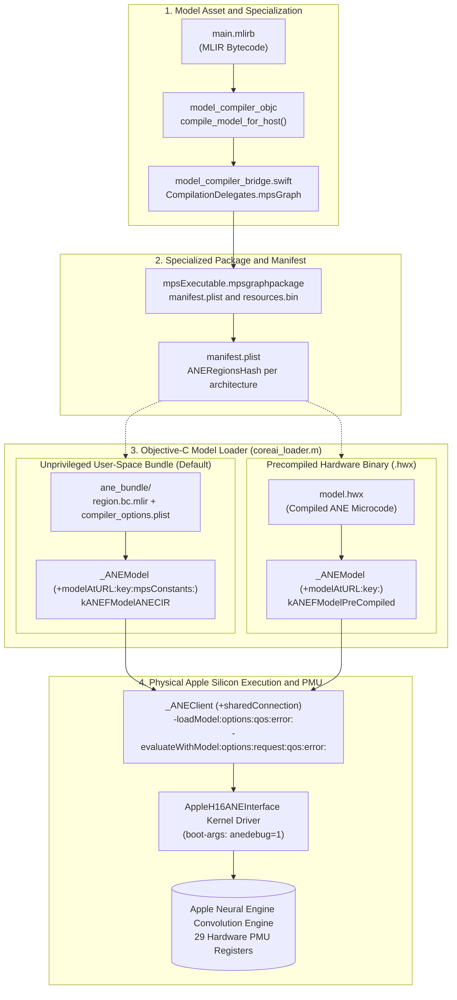

# Apple Neural Engine (ANE) Silicon PMU Profiling & Model Loading Toolkit

This repository contains a high-performance, self-contained Objective-C and C toolkit for compiling, loading, and profiling deep neural network models directly on physical Apple Neural Engine (ANE) silicon via hardware **Performance Monitoring Unit (PMU)** counters.

---

## 1. Features & Highlights

- **Live Physical Silicon PMU Streaming**: Unlocks the kernel driver gate (`AppleH1xANEInterface`) to stream all **29 64-bit hardware PMU registers** per inference, including:
  - Neural Engine (NE) convolution engine MAC cycles (`kANE_NE_COMPUTE_CYCLES`)
  - Planar Engine (PE / L2PE) vector cycles (`kANE_L2PE_COMPUTE_CYCLES`)
  - Unified memory DMA read/write bandwidth (`kANE_DMA_READWRITE_BYTES`)
  - Pipeline input/output stalls (`kANE_NE_OUTPUT_STALL_CYCLES`, `kANE_L2PE_INPUT_STALL_CYCLES`)
  - Dynamic DVFS frequency scaling and thermal throttling telemetry
- **Direct Unprivileged User-Space ANE Execution (`kANEFModelANECIR`)**: Directly loads and compiles localized ANE bundles (`<regionKey>.bc.mlir` + `compiler_options_<regionKey>.plist`) via `_ANEClient` in pure user space—**no root privileges, `sudo`, or access to `/Library/Caches/com.apple.aned` required**.
- **Direct Silicon Memory Mapping (`kANEFModelPreCompiled`)**: Alternatively binds precompiled `.hwx` microcode directly into `_ANEClient` via `+[_ANEModel modelAtURL:key:]` ($1.26\text{ ms}$ steady-state inference on ResNet-50 FP16).
- **In-Process Host JIT Compiler**: Automatically compiles and specializes MLIR bytecode (`.mlirb`) for the host architecture (`targetSOC: "this"`) in-process without spawning external shell processes.
- **Pure C MLIR Pass Pipeline**: Includes a native C implementation of `libODIECompiler.dylib`'s 5-pass compilation pipeline (`odiec_pipeline.c`).
- **Comprehensive Documentation**: Includes [`ANE_Performance_PMU_Technical_Report.md`](file:///Users/freedom/work/ios-hacking/ane_pmu_profiler/ANE_Performance_PMU_Technical_Report.md) and [`ODIE_Compiler_C_API_and_Pass_Pipeline.md`](file:///Users/freedom/work/ios-hacking/ane_pmu_profiler/ODIE_Compiler_C_API_and_Pass_Pipeline.md).

---

## 2. Architecture Overview



---

## 3. Directory Layout

```
ane_pmu_profiler/
├── ANE_Performance_PMU_Technical_Report.md  # Exhaustive microarchitectural PMU technical report
├── ODIE_Compiler_C_API_and_Pass_Pipeline.md # libODIECompiler C-API & 62-function table reference
├── README.md                                # Repository guide
├── Makefile                                 # Unified build automation with ad-hoc codesigning
├── entitlements.plist                       # com.apple.ane.hardware-counters entitlement
├── .gitignore                               # Clean git ignore configuration
├── dump_ane_pmu.m                           # 29-register hardware PMU profiler & inference runner
├── coreai_loader.h                          # Objective-C declarations for _ANEClient, _ANEModel, MPSGraph
├── coreai_loader.m                          # Direct model loader using manifest region hash
├── model_compiler.h                         # Clean C interface: compile_model_for_host()
├── model_compiler.m                         # Objective-C CLI tool for host JIT compilation
├── model_compiler_bridge.swift              # Swift bridge wrapping CoreAICompiler delegation
├── odiec_pipeline.h                         # C-API table declaration for libODIECompiler.dylib
├── odiec_pipeline.c                         # Pure C MLIR pass pipeline implementation
└── resnet50_fp16.aimodel/                   # Sample ResNet-50 FP16 CoreAI model bundle
    └── main.mlirb                           # Input MLIR bytecode
```

---

## 4. Prerequisites & Hardware Setup

1. **Apple Silicon Hardware**: Mac equipped with M-series chip (e.g. M4 / Apple H16g).
2. **Entitlement & Kernel Boot-Args**:
   The hardware PMU registers are gated by `AppleH1xANEInterface`. To stream raw hardware counters:
   - Set the boot argument:
     ```bash
     sudo nvram boot-args="amfi_get_out_of_my_way=0x1 anedebug=1"
     ```
   - Reboot the system.
   - All binaries must be ad-hoc signed with [`entitlements.plist`](file:///Users/freedom/work/ios-hacking/ane_pmu_profiler/entitlements.plist) (handled automatically by `Makefile`).
3. **Unprivileged User-Space Execution (No Root / No `sudo` Required)**:
   The profiler operates entirely in **unprivileged user space**:
   - **Mode A: Direct User-Space ANE Bundle (`kANEFModelANECIR`, Default)**:
     The loader locates or prepares the localized ANE bundle (`<regionKey>.bc.mlir` and `compiler_options_<regionKey>.plist`) in `<modelDir>/output_host_jit/ane_bundle`. `_ANEClient` loads and compiles the bundle into silicon without accessing root-restricted system directories.
   - **Mode B: Precompiled Hardware Microcode (`kANEFModelPreCompiled`)**:
     If a local `model.hwx` exists in the model directory or is specified via `ANE_HWX_PATH`, the loader binds the raw microcode directly.
   *(Note: Accessing the system daemon cache at `/Library/Caches/com.apple.aned` is entirely optional and only occurs if readable; user-space execution works out of the box without `sudo` or changing system directory permissions).*
4. **CoreAI Private Swift Interface Generation**:
   Because `CoreAICompiler.framework` and `CoreAIDelegates.framework` are Apple-private frameworks without public SDK headers, [swift_interface_gen](https://github.com/freedomtan/swift_interface_gen/) is used to extract and generate their `.swiftinterface` files:
   ```bash
   git clone https://github.com/freedomtan/swift_interface_gen.git ~/work/swift_interface_gen
   # Generates LocalFrameworks/CoreAICompiler.framework and LocalFrameworks/CoreAIDelegates.framework
   ```
   The `Makefile` resolves these private module interfaces via `LOCAL_FRAMEWORKS = $(HOME)/work/swift_interface_gen/LocalFrameworks`.

---

## 5. Building the Toolkit

Run `make all` from the repository root:

```bash
make all
```

This compiles and signs:
1. `model_compiler_objc`: Standalone host JIT compiler.
2. `coreai_loader`: Fast model loader and tensor dimension inspector.
3. `dump_ane_pmu_objc`: Full 29-register hardware PMU profiler.

---

## 6. Usage & Workflows

### 1. Specialize Model for Host ANE Silicon
Compiles `.mlirb` bytecode into an `mpsgraphpackage` specialized for the host machine:
```bash
./model_compiler_objc resnet50_fp16.aimodel/main.mlirb resnet50_fp16.aimodel/output_host_jit
```

### 2. Standalone Model Loading & Inspection
Validates tensor buffer sizes and verifies that the model loads directly into physical ANE silicon:
```bash
./coreai_loader resnet50_fp16.aimodel
```

### 3. Live Hardware PMU Profiling Benchmark
Dispatches real-time inference on physical ANE hardware and prints the decoded 29-register PMU report:
```bash
# Standard execution (auto-detects local .hwx or runs unprivileged user-space ANE bundle)
./dump_ane_pmu_objc resnet50_fp16.aimodel

# Explicitly force unprivileged user-space ANE bundle execution (kANEFModelANECIR)
FORCE_USER_SPACE_ANE_BUNDLE=1 ./dump_ane_pmu_objc resnet50_fp16.aimodel

# Or specify a custom standalone .hwx path
./dump_ane_pmu_objc resnet50_fp16.aimodel --hwx path/to/model.hwx
```

---

## 7. Decoded Silicon PMU Register Table

| Index | Hardware Register Name | Hardware Subsystem / Unit | Telemetry Description |
| :---: | :--- | :--- | :--- |
| **[00]** | `kANE_AF_TO_L2_DATA` | On-Chip L2 SRAM Bus | Activation feeder bytes transferred to L2 |
| **[01]** | `kANE_AF_TO_KM_DATA` | On-Chip L2 SRAM Bus | Kernel memory feeder transfers |
| **[02]** | `kANE_L2_TO_AF_DATA` | On-Chip L2 SRAM Bus | L2 scratchpad writeback traffic |
| **[03]** | `kANE_L2_TO_NE_DATA` | On-Chip L2 SRAM Bus | L2 SRAM bytes delivered to Neural Engine matrix cores |
| **[04]** | `kANE_NE_TO_L2_DATA` | On-Chip L2 SRAM Bus | Neural Engine matrix output written back to L2 |
| **[05]** | `kANE_INT8_CYCLES` | Convolution Engine (MACs) | Execution cycles in INT8 precision mode |
| **[06]** | `kANE_FP16_CYCLES` | Convolution Engine (MACs) | Execution cycles in FP16 precision mode |
| **[07]** | `kANE_L2_READ_STALL_CYCLES` | Pipeline Stall Detection | Cycles stalled waiting for L2 SRAM read access |
| **[08]** | `kANE_L2_WRITE_STALL_CYCLES`| Pipeline Stall Detection | Cycles stalled waiting for L2 SRAM write queue |
| **[09]** | `kANE_KM_STALL_CYCLES` | Pipeline Stall Detection | Kernel memory buffer congestion stalls |
| **[10]** | `kANE_NE_NOMINAL_CYCLES` | Convolution Engine (MACs) | Baseline reference clock cycles (steady-state DVFS) |
| **[11]** | `kANE_NE_THROTTLE_CYCLES` | Power & Thermal Mgmt | Cycles throttled due to thermal or power budget limits |
| **[12]** | `kANE_L2_THROTTLE_CYCLES` | Power & Thermal Mgmt | L2 SRAM bus throttling cycles |
| **[13]** | `kANE_NE_COMPUTE_CYCLES` | Convolution Engine (MACs) | **Active convolution engine Multiply-Accumulate compute cycles** |
| **[14]** | `kANE_NE_INPUT_STALL_CYCLES` | Pipeline Stall Detection | Cycles convolution engine stalled waiting for input activations |
| **[15]** | `kANE_NE_OUTPUT_STALL_CYCLES`| Pipeline Stall Detection | Cycles convolution engine stalled waiting to flush output tensors |
| **[16]** | `kANE_NE_KERNEL_STALL_CYCLES`| Pipeline Stall Detection | Cycles stalled loading weight matrices |
| **[17]** | `kANE_DMA_READWRITE_BYTES` | Unified Memory DMA Bus | **Total Unified Memory DRAM traffic (Read + Write bytes)** |
| **[18]** | `kANE_DMA_READ_BYTES` | Unified Memory DMA Bus | **Unified Memory DRAM read traffic (Input tensors & spills)** |
| **[19]** | `kANE_DPE_ENERGY` | Power & Thermal Mgmt | Dynamic Power Engine (DPE) energy accumulator units |
| **[20]** | `kANE_L2_NOMINAL_CYCLES` | On-Chip L2 SRAM Bus | L2 memory controller clock cycles |
| **[21]** | `kANE_L2PE_COMPUTE_CYCLES` | Planar Engine (Vector PE)| **Active vector ALU cycles (ReLU, GeLU, Pooling, Add)** |
| **[22]** | `kANE_L2PE_INPUT_STALL_CYCLES`| Planar Engine (Vector PE)| Vector engine stalls waiting for operands |
| **[23]** | `kANE_L2PE_OUTPUT_STALL_CYCLES`| Planar Engine (Vector PE)| Vector engine stalls writing back results |
| **[24-28]** | `kANE_UNKNOWN` | Reserved / Internal | Firmware-internal reserved diagnostic registers |

---

## 8. Technical References

- [`ANE_Performance_PMU_Technical_Report.md`](file:///Users/freedom/work/ios-hacking/ane_pmu_profiler/ANE_Performance_PMU_Technical_Report.md): Complete research report detailing the microarchitectural analysis of ResNet-50 vs. MobileNetV2, convolution engine efficiency bottlenecks, and driver security models.
- [`ODIE_Compiler_C_API_and_Pass_Pipeline.md`](file:///Users/freedom/work/ios-hacking/ane_pmu_profiler/ODIE_Compiler_C_API_and_Pass_Pipeline.md): Comprehensive reference for `libODIECompiler.dylib` C-API, AAPCS64 register `x8` return convention, and MLIR pass execution sequence.
